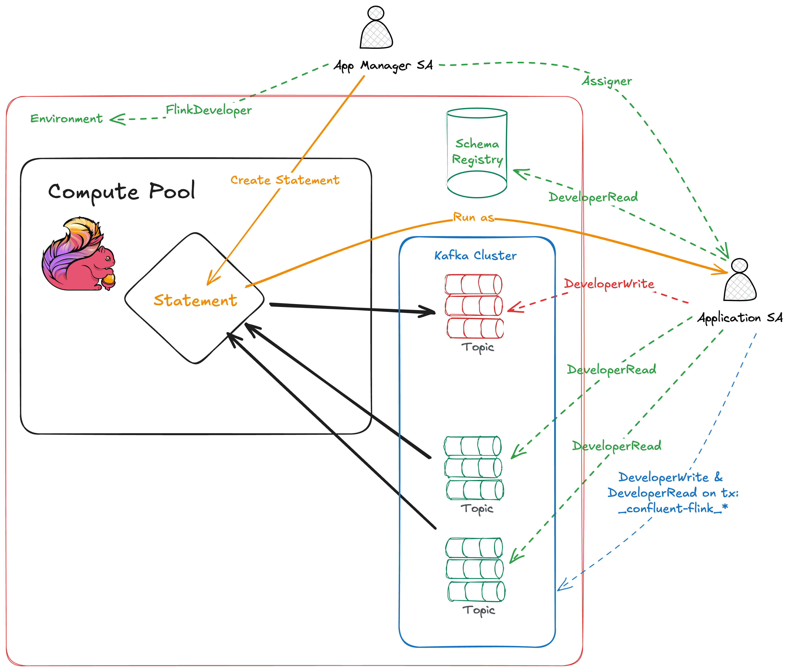

# Confluent Cloud Flink SQL Scripts

This directory contains bash scripts for deploying and managing Flink SQL statements in Confluent Cloud using the REST API.

## Prerequisites

- `curl` command-line tool
- `jq` for JSON processing
- Valid Confluent Cloud API credentials

# Privilege model



## Setup

1. **Configure credentials**: 
   ```bash
   # Copy the template file and fill in your actual credentials
   cp credentials.properties.template credentials.properties
   
   # Edit credentials.properties with your actual values
   # The template contains all required fields with placeholder values
   ```

   **Required Credentials:**
   - **Management API Keys** (Cloud-scoped): For Flink statement operations
   - **Kafka API Keys** (Cluster-scoped): For consumer group operations
   - **Kafka REST Endpoint**: For consumer group API access
   - **Service Account IDs**: For statement execution and permissions

2. **Set up service accounts**:

   ### Management Service Account (Control Plane)
   Create in Confluent Cloud Console → Settings → API Access:

   **Role Comparison:**
   | Role | Scope | Can Manage | Clean Operation | Best For |
   |------|--------|------------|-----------------|----------|
   | `FlinkAdmin` | All statements | ANY statement in environment | Cleans ALL non-running statements | Team/shared environments |
   | `FlinkDeveloper` | Own statements | Only statements created by this service account | Cleans ONLY own statements | Individual/isolated use |

   - **Recommended**: `FlinkDeveloper` for individual developer use (more restrictive)
   - **Alternative**: `FlinkAdmin` for shared/team environments
   - **Must be**: Flink / Cloud API Key (not Cluster API Key)
   - **Used for**: API operations via this script

   - **Assigner role**: Assigner role to manage the execution service account 

   ### Execution Service Account (Data Plane) 
   Create a separate service account for statement execution:
   - **Required Permissions** (following least-privilege principle):
     - **Data Access**: Read/write access to specific topics and schemas
     - **Transaction**: Read/Write on transaction prefix: _confluent_flink_
   - **Permission Inheritance**: "Statements inherit all permissions from the principal that runs them"
   - **Used as**: The principal (`sa-xxxxxx`) that executes your Flink SQL statements

   ### Other Requirements
   - **Environment ID**: Found in your environment URL or CLI  
   - **Compute Pool ID**: Create/find in Confluent Cloud Console → Flink
   - **Organization ID**: Found in organization settings

## Usage

### Unified Flink Statement Tool

Use the unified `flink-statement.sh` script for all operations:

```bash
./flink-statement.sh <action> [options]
```

#### Deploy a new statement
```bash
# Deploy with auto-generated name
./flink-statement.sh deploy sample-query.sql

# Deploy with custom name  
./flink-statement.sh deploy my-analytics-query.sql "basket-analytics"
```

#### List statements
```bash
# List all statements
./flink-statement.sh list

# Filter by status
./flink-statement.sh list --status RUNNING
./flink-statement.sh list --status FAILED

# Filter by principal (creator)  
./flink-statement.sh list --principal sa-38wrwom
./flink-statement.sh list --principal u-p96jr5

# Combine filters
./flink-statement.sh list --principal sa-38wrwom --status COMPLETED
```

#### Get statement details
```bash
./flink-statement.sh get workspace-2025-08-08-092755-01a9f250-5039-4426-8b97-8f42869a9892
```

#### Stop a running statement
```bash
./flink-statement.sh stop workspace-2025-08-08-092755-01a9f250-5039-4426-8b97-8f42869a9892
```

#### Delete a statement
```bash
./flink-statement.sh delete workspace-2025-08-08-092755-01a9f250-5039-4426-8b97-8f42869a9892
```

#### Clean up statements
```bash
# Basic cleanup (interactive)
./flink-statement.sh clean

# Force mode (no confirmation)
./flink-statement.sh clean --force

# Filter by principal (clean only your statements)
./flink-statement.sh clean --principal sa-38wrwom

# Filter by status (clean only specific status)
./flink-statement.sh clean --status COMPLETED
./flink-statement.sh clean --status FAILED

# Combine filters and options
./flink-statement.sh clean --principal u-p96jr5 --status COMPLETED --force

# Verify cleanup status
./flink-statement.sh verify-clean
```

#### Get statement offsets
```bash
# Get offsets for all statements that have offset data
./flink-statement.sh offsets

# Get offsets for specific statement
./flink-statement.sh offsets statement-name

# Get offsets for all stopped statements (most useful)
./flink-statement.sh offsets --status STOPPED

# Get offsets for statements by specific principal
./flink-statement.sh offsets --principal u-p96jr5
```
**Offset Information**: Shows the last processed position in each source topic. Particularly useful for STOPPED statements to understand where processing was interrupted and for resuming data processing from the correct position.

**Clean Operation Features:**
- **Smart Filtering**: Target specific principals or status types
- **Interactive Mode**: Shows what will be deleted and asks for confirmation
- **Force Mode**: Skip confirmation for automation
- **Ownership Awareness**: Prevents deletion of statements you don't own
- **Detailed Feedback**: Shows success/failure for each statement

**Important Limitations**:
- **Ownership Restriction**: You can only delete statements created by the same service account
- **Role Impact**: FlinkDeveloper role limits cleanup to own statements only  
- **Async Processing**: Deletions are processed asynchronously and may take time to complete
- Use `verify-clean` to check current status and see ownership details

**Important Notes:**
- **Statements are immutable** - you cannot update them after creation
- **Operations are asynchronous** - stop/delete operations may return HTTP 202 (accepted) and process in the background
- **To modify a statement:**
  1. Stop the existing statement (if running): `./flink-statement.sh stop <name>`
  2. Delete the existing statement: `./flink-statement.sh delete <name>`
  3. Deploy a new statement: `./flink-statement.sh deploy <sql-file> <new-name>`

## Filtering Options

Both `list` and `clean` operations support powerful filtering:

### Filter by Principal (Creator)
```bash
# List statements created by specific service account
./flink-statement.sh list --principal sa-38wrwom

# Clean only statements created by specific user
./flink-statement.sh clean --principal u-p96jr5
```

### Filter by Status
```bash
# List only running statements
./flink-statement.sh list --status RUNNING

# Clean only failed statements
./flink-statement.sh clean --status FAILED --force
```

### Common Status Values:
- `RUNNING` - Currently executing
- `COMPLETED` - Finished successfully
- `FAILED` - Terminated with error
- `STOPPED` - Manually stopped
- `PROVISIONING` - Starting up

### Combine Filters:
```bash
# List completed statements by specific principal
./flink-statement.sh list --principal sa-abc123 --status COMPLETED

# Clean failed statements created by specific user
./flink-statement.sh clean --principal u-xyz789 --status FAILED --force
```

### Consumer Group Offsets Tool

Use the `consumer-group-offsets.sh` script to retrieve committed offsets from consumer groups and format them for Flink statements:

```bash
./consumer-group-offsets.sh <action> [options]
```

#### Get consumer group offsets
```bash
# Get offsets for specific consumer group (with Flink format)
./consumer-group-offsets.sh offsets my-consumer-group

# List all consumer groups in the cluster
./consumer-group-offsets.sh list

# Show usage help
./consumer-group-offsets.sh help
```

**Key Features:**
- **Offset Retrieval**: Gets committed offsets from any consumer group
- **Flink Formatting**: Automatically formats offsets for Flink SQL statements
- **Multiple Formats**: Shows both human-readable and Flink-specific configuration
- **Topic Grouping**: Groups offsets by topic with proper partition mapping

**Requirements:**
- Requires **Kafka API Keys** (cluster-scoped) in addition to management API keys
- Add `kafka_api_key`, `kafka_api_secret`, `kafka_rest_endpoint`, and `cluster_id` to credentials.properties

## Files

- `flink-statement.sh` - **Main unified script** for all Flink statement operations
- `consumer-group-offsets.sh` - **Consumer group offset retrieval** script with Flink formatting
- `credentials.properties.template` - Template file for API credentials (safe to commit)
- `credentials.properties` - Your actual API credentials (ignored by git)
- `sample-query.sql` - Example Flink SQL query for testing
- `replicate-data.sql` - Simple data replication example
- `debug-api.sh` - Debug script for testing API connectivity
- `.gitignore` - Protects sensitive files from being committed
- `README.md` - This documentation


## Error Handling

The script includes:
- Credential validation
- HTTP response code checking
- JSON error response parsing  
- Proper exit codes for automation

## Permission Troubleshooting

### Common HTTP Error Codes

| Error | Cause | Solution |
|-------|-------|----------|
| **HTTP 403** | Insufficient permissions | Grant `FlinkAdmin` or `FlinkDeveloper` role to management service account |
| **HTTP 401** | Invalid API key | Verify you're using correct API key type (Cloud vs Cluster) |
| **HTTP 404** | Wrong endpoint/region | Check `base_url` and endpoints match your region |
| **HTTP 400** | Malformed request | Usually indicates incorrect JSON format |
| **HTTP 202** | ✅ Async operation accepted | Normal for delete/stop operations |

### API Key Types and Usage

| Operation | Required API Key Type | Endpoint Type | Notes |
|-----------|----------------------|---------------|-------|
| **Flink Statements** | Management API Keys (Cloud) | Flink Management API | For deploy/list/delete/stop operations |
| **Consumer Groups** | Kafka API Keys (Cluster) | Kafka REST API | For offset retrieval and consumer group operations |

**Authentication Errors:**
- `flink-statement.sh`: Use **Management API Keys** (Cloud-scoped)
- `consumer-group-offsets.sh`: Use **Kafka API Keys** (Cluster-scoped)
- Wrong key type will result in HTTP 401 errors

### Permission Validation Steps

1. **Verify Management Service Account**:
   ```bash
   # Check if your service account has FlinkAdmin or FlinkDeveloper role
   # Go to Confluent Cloud Console → Environment → Access → Service Accounts
   # FlinkAdmin: Can manage ALL statements (recommended)
   # FlinkDeveloper: Can only manage statements created by this service account
   ```

2. **Verify Execution Service Account**:
   ```bash
   # Ensure execution service account has:
   # - FlinkDeveloper role in environment
   # - Read/write access to relevant topics
   # - Flink Transaction role
   # - Schema registry access (if using schemas)
   ```

3. **Test Permissions Incrementally**:
   ```bash
   ./flink-statement.sh list                    # Requires FlinkDeveloper+
   ./flink-statement.sh deploy sample-query.sql # Requires FlinkAdmin or FlinkDeveloper
   ```

### Service Account Best Practices

- **Least Privilege**: Grant minimum required permissions
- **Separate Concerns**: Use different service accounts for management vs execution  
- **Environment Scope**: Permissions are environment-specific
- **Audit Regularly**: Review and rotate API keys periodically

## Security Notes

- ✅ **Git Protection**: `credentials.properties` is automatically ignored by git via `.gitignore`
- ✅ **Template System**: Use `credentials.properties.template` for safe commits and team sharing
- **Two-Service Account Architecture**:
  - **Management Account**: Only has permissions to manage Flink statements (create/delete/stop)
  - **Execution Account**: Only has data access permissions (read source topics, write destination topics)
  - This separation follows the principle of least privilege
- **Best Practices**:
  - Use environment-specific credential files for different deployments
  - Never commit actual credentials to version control
  - The execution service account ID format is typically `sa-xxxxxx`
- Consider using Confluent Cloud CLI for interactive development